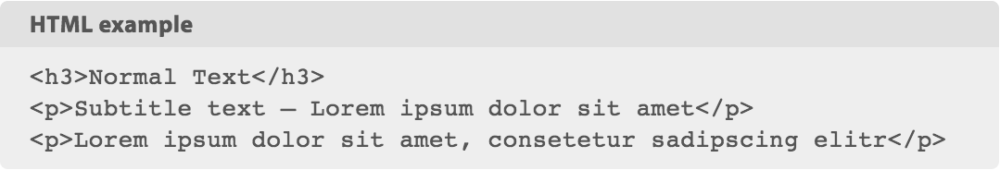

#ga-code

**Simple code block formatting. [Demo page](demo/index.html)**

##Installation

You may have to install [Bower](https://bower.io/) first, if not installed globally. Run in terminal:

```bash
$ npm install -D bower
$ bower install ga-code
```

##LESS and CSS

Include the LESS file in your project main LESS and customize its variables to your needs. After compilation, the ga-code styles are part of your project CSS.

```less
@import "bower_components/ga-code/less/ga-code.less";

@ga-code-border-radius:     3px;
@ga-code-color:             #555;
@ga-code-background:        #eee;
@ga-code-font-family:       inherit;
@ga-code-title-font-family: sans-serif;

// Recommended:
@ga-code-font-family: Hack, Menlo, Monaco, Consolas, "Courier New", monospace; 
```

Bootstrap 3 users will also like:

```less
@ga-code-font-family:       @font-family-monospace; 
@ga-code-title-font-family: @font-family-base;
```


Alternatively, you can use the CSS with the above defaults directly:

```html
<link rel="stylesheet" href="bower_components/ga-code/css/ga-code.min.css">
```


##HTML Usage

Wrap a *pre* element around a *code* element as you would do normally; To define a proper title, add a `data-code` attribute to the *pre*, and optionally a `data-code-title` attribute with a custom description.

```html
<pre data-code="html" data-code-title="HTML example"><code>&lt;h3&gt;Normal Text&lt;/h3&gt;
&lt;p&gt;Subtitle text &ndash; Lorem ipsum dolor sit amet&lt;/p&gt;
&lt;p&gt;Lorem ipsum dolor sit amet, consetetur sadipscing elitr&lt;/p&gt;
</code></pre>
```

The result should look like this:



##Changelog

####v1.1.0
- Better font support with LESS variables
- Added Demo page

##Develop with Gulp

Use [Git Flow](https://github.com/nvie/gitflow), always work in `develop` branch.

- Install development dependencies: `npm install`
- Run `gulp watch`

Builds are now in `css/`
